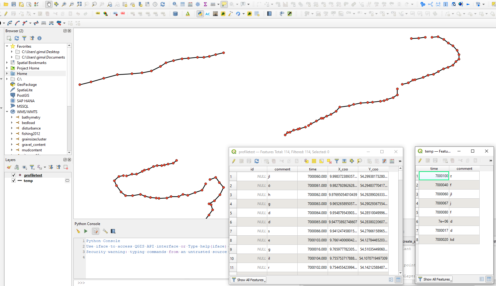

# PyQgis_trackpoints2lineparts

Small PyQGIS script, converting point shapefiles to multiple lines in shapefile. Output is a temporary layer.

- maximal allowed gap size has to be specified manually
- length of line parts (still just in form of number of points of profile) has to be specified manually

